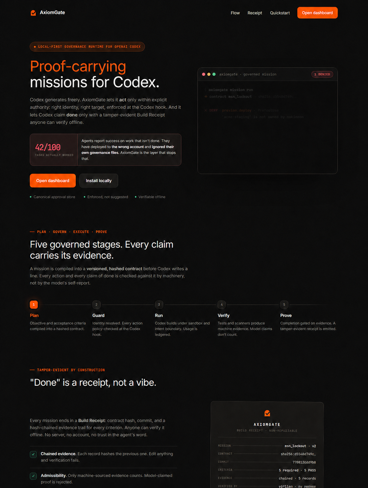
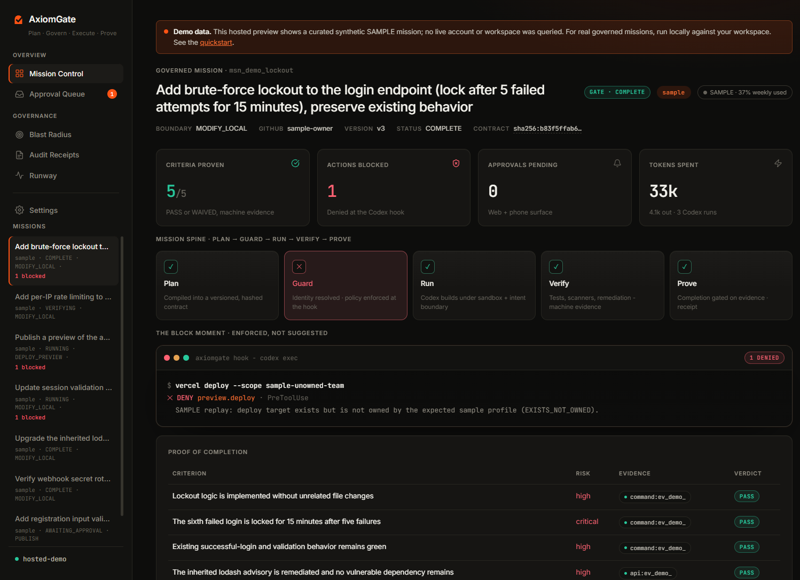

# AxiomGate

[](https://www.npmjs.com/package/axiomgate)
[](LICENSE)
[](CODEX_COLLABORATION.md)

## Proof-carrying missions for Codex

AxiomGate lets Codex act only within explicit authority enforced at the Codex hook, then lets it claim completion only when fresh machine evidence satisfies the mission contract. Each governed mission ends in a tamper-evident Build Receipt that anyone can verify offline.

> Codex does the work. AxiomGate carries the proof.

## Why this exists

Coding agents can be confident and wrong. A 2026 practitioner study reported that agents marked 100 tasks complete while only 42 actually worked; an independent academic study measured false-success behavior in 44–52% of observed failures ([BSWEN analysis](https://docs.bswen.com/blog/2026-03-12-ai-agent-self-verification/), [arXiv:2606.09863](https://arxiv.org/abs/2606.09863)). In a separate deployment incident, an agent fabricated a repository identifier and deployed the wrong code because it never verified target ownership ([incident report](https://awesomeagents.ai/news/openclaw-opus-hallucinated-repo-id-vercel-deploy/)). OpenAI Codex issue [#16798](https://github.com/openai/codex/issues/16798) records the broader failure mode: an agent can ignore repository governance unless enforcement sits outside model narration.

AxiomGate makes both failures testable: unsafe actions are denied at the hook boundary, and unsupported completion claims remain blocked at the evidence gate.

## 90-second quickstart

Published package:

```powershell
npx -y axiomgate@0.1.0 doctor
npx -y axiomgate@0.1.0 replay all
```

`replay all` needs no Codex login or cloud credentials. It executes three deterministic regressions through production logic: wrong-target ownership denial, exact-command approval binding, and missing-evidence completion blocking.

From a clean clone, the same path is also available from source:

```powershell
git clone https://github.com/mokimeow/axiomgate.git
Set-Location axiomgate
corepack enable
pnpm install --frozen-lockfile
pnpm build
node apps/cli/dist/index.js replay all
node apps/cli/dist/index.js receipt verify scripts/fixtures/publish-receipt.json
node scripts/tamper-receipt.mjs scripts/fixtures/publish-receipt.json .local/tampered-receipt.json
node apps/cli/dist/index.js receipt verify .local/tampered-receipt.json
```

The final command must print `FAIL` and exit non-zero. See [JUDGE-QUICKSTART.md](JUDGE-QUICKSTART.md) for expected output and the optional authenticated mission lifecycle.

## Enforced authority versus proven outcomes

| Guardrail | What AxiomGate does |
|---|---|
| Identity and target | Resolves GitHub/Vercel identity and proves that a publish/deploy target exists and is owned before use. |
| Intent boundary | Maps `OBSERVE` through `DEPLOY_PRODUCTION` to sandbox/network authority; production deploy is refused in this Build Week release. |
| Semantic policy | Classifies commands and MCP tools into actions, then applies deterministic `ALLOW`, `DENY`, or `REQUIRE_APPROVAL` policy. Unknown state-changing actions fail closed. |
| Approval binding | Binds a single-use, expiring approval to the exact command hash. Mutation or reuse is denied. |
| Telegram relay | Optionally long-polls Telegram for allowlisted, exact-hash approvals and redacted stage notifications; no webhook or public URL is required. |
| Completion gate | Accepts only fresh `command`, `api`, or `hook` evidence. Model prose is advisory and cannot make a criterion pass. |
| Build Receipt | Hash-chains stored evidence and supports offline integrity, freshness, contract-hash, and no-false-green verification. |

## How Codex and GPT-5.6 are used

AxiomGate is built around native Codex surfaces rather than prompt-only conventions:

- `PreToolUse` and `PermissionRequest` hooks enforce decisions with machine JSON and persist each outcome.
- `codex exec --json` provides governed Builder and fresh, read-only Verifier sessions, event streams, command executions, and token actuals.
- the Codex App Server method `account/rateLimits/read` supplies real usage-window percentage, reset time, plan type, and banked reset metadata; failures render `UNKNOWN` rather than invented capacity;
- a repository Codex [skill](.agents/skills/axiomgate/SKILL.md), a read-only [custom verifier agent](.agents/agents/axiomgate-verifier.toml), an [MCP server](apps/cli/src/mcp.ts), and a [plugin marketplace manifest](.agents/plugins/marketplace.json) make governance discoverable through native integration points.

The Model Director records a rationale per phase. GPT-5.6 Luna/Light scouts structured context, Sol/High builds, Sol/Max is recommended for high- or critical-risk security work, Terra/Medium performs bounded remediation, and Terra/High independently challenges the diff. “Ultra” is documented honestly as native multi-agent capability, not a reasoning level and not orchestrated by AxiomGate in this release.

The real headline mission used **7 governed sessions** and **3,159,955 input-plus-output tokens**, captured from its ledger: Luna/Light for the block proof, Sol/High for the security implementation, and Terra/Medium or Terra/High for remediation and independent review. The sanitized session ledger is documented in [CODEX_COLLABORATION.md](CODEX_COLLABORATION.md).

## Architecture

```text
objective
   │
   ▼
 PLAN ── contract + model plan + runway
   │
 GUARD ─ identity + target proof + hook policy + approvals
   │
  RUN  ─ governed Codex Builder + independent Verifier
   │
 VERIFY ─ native tests/build + PatchPilot scan + secret scan + remediation
   │
 PROVE ─ criterion verdicts + permission quads + offline Build Receipt
```

| Stage | Main implementation | Design reference |
|---|---|---|
| Plan | `src/mission`, `src/runway` | [Mission Compiler](docs/03-MISSION-COMPILER.md), [Runway](docs/04-RUNWAY.md) |
| Guard | `src/guard` | [Environment Guard](docs/05-ENVIRONMENT-GUARD.md) |
| Run | `src/runtime` | [Codex Runtime](docs/06-CODEX-RUNTIME.md) |
| Verify | `src/verification` | [Verification Engine](docs/07-VERIFICATION-ENGINE.md) |
| Prove | `src/evidence` | [Evidence Gate](docs/08-EVIDENCE-GATE.md) |

The verification boundary invokes the published `patchpilot-cli@0.1.3` unchanged, then combines its dependency findings with the target repository’s native test/build commands and secret scan. PatchPilot source is not copied or represented as Build Week work.

## Product surfaces

The local dashboard renders a seeded synthetic mission on a clean clone and real `.axiomgate` state when pointed at a governed workspace. Public screenshots are path-redacted captures of the bundled sample data.





## Judge path and support

Start with [JUDGE-QUICKSTART.md](JUDGE-QUICKSTART.md). The deterministic replay and sample receipt require no personal account, credential, paid service, or network after dependencies are installed. The public repository and npm package are intended to remain free through judging.

- **Verified:** Windows 11, PowerShell, Node.js 20+, pnpm 10, Codex CLI 0.144.x.
- **Untested:** macOS and Linux. The implementation avoids platform-specific package scripts, but no cross-platform claim is made yet.
- **Optional live path:** requires the judge’s own Codex authentication; GitHub/Vercel checks require the judge’s own corresponding CLI login.

## Security and privacy

- The dashboard binds to loopback, serves only its packaged public directory, validates same-origin approval writes, bounds request bodies, and confines mission paths.
- External commands use the shared timeout runner. Hook stdout stays machine-JSON only; internal failures deny rather than silently fail open.
- Persisted command, verifier, verification, and deploy-target diagnostics pass through centralized credential redaction before hashing or storage.
- `.local/`, `.axiomgate/`, `.vercel/`, dependency trees, build output, environment files, tarballs, and raw run logs are excluded from Git.
- Optional Telegram approvals read `TELEGRAM_BOT_TOKEN` and the comma-separated `TELEGRAM_CHAT_ID` allowlist only from the process environment or ignored `.local/telegram.env`. Run `axiomgate telegram test`, then `axiomgate telegram watch --project <path>`; persisted relay state contains hashed chat identifiers, never the token or full chat ID.
- Demo users, IDs, tokens, and wrong-target profiles are synthetic. Presenter substitutions are explicitly labelled in [demo/DEMO-RUNBOOK.md](demo/DEMO-RUNBOOK.md).

See the [threat model](docs/10-SECURITY-THREAT-MODEL.md), [negative guard suite](packages/axiomgate-core/test/negative-guard.test.ts), and [public evidence index](evidence/public/README.md).

## Submission evidence

- [Hackathon delta](HACKATHON_DELTA.md) — exact pre-event baseline and Build Week scope.
- [Codex collaboration log](CODEX_COLLABORATION.md) — model roles, seven-session headline ledger, and verified hook probes.
- [Headline run evidence](evidence/public/headline-run-verification.md) — real lockout mission, denial, remediation, review, and receipt proof.
- [Sample offline-verifiable receipt](scripts/fixtures/publish-receipt.json).
- [Implementation status](docs/21-IMPLEMENTATION-STATUS.md) — evidence-linked product truth.

## Roadmap

- complete a live Telegram card/details/approval proof when valid presenter credentials are available;
- test macOS/Linux and publish a supported-platform matrix;
- adopt deterministic named custom-agent targeting when Codex exposes it non-interactively;
- broaden replay coverage beyond the three Build Week security regressions;
- add post-hackathon quota/provider normalization without inventing capacity data.

## License

[MIT](LICENSE) © 2026 [mokimeow](https://github.com/mokimeow).
